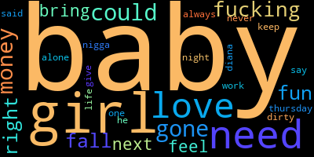

# The Weeknd NLP

My Natural Language Processing project analyzing the lyrics of The Weeknd!

### Key Folders:

1) Data - csv files of all data used in my project
2) Images - All graphs, plots, and data viz objects developed
3) Notebooks - .ipynb Python Jupyter Notebook Viewer files with all my code

### Explored NLP topics:

1) Bag of Words
2) Tokenization/Stemming/Lemmetization
3) Sentiment Analysis
4) Word Clouds
5) Lyrical Repetitiveness




``` 
here is a code block. HYpe
 ```
